# Evaluación técnica 2.

## Entregables
Se entregara un archivo editable tipo google doc/word con las respuestas de la parte escrita, ademas de eso se entregara un pdf de lo mismo como respaldo.
Para la parte programada se entregara un archivo de texto con el link del repositorio de github que se uso para la realización del proyecto, ademas de mi auto-evaluación.

### 1. Crear los proyectos para la aplicación en la solución. Programar la funcionalidad necesaria de la aplicación en el branch devCARNET. Realice commits al branch devCARNET e integre cada vez que tenga parte de la funcionalidad finalizada y funcionando al branch main, lo que implica realizar los procesos de integración. Aplique todas las buenas prácticas de la ingeniería de software y las recomendaciones de la ET1.

[x] Agregar contenidos a una carrera (5%), tarea realizada en frontend y backend, se puede agregar un contenido a una carrera existente o crear una carrera nueva y agregarle un contenido.

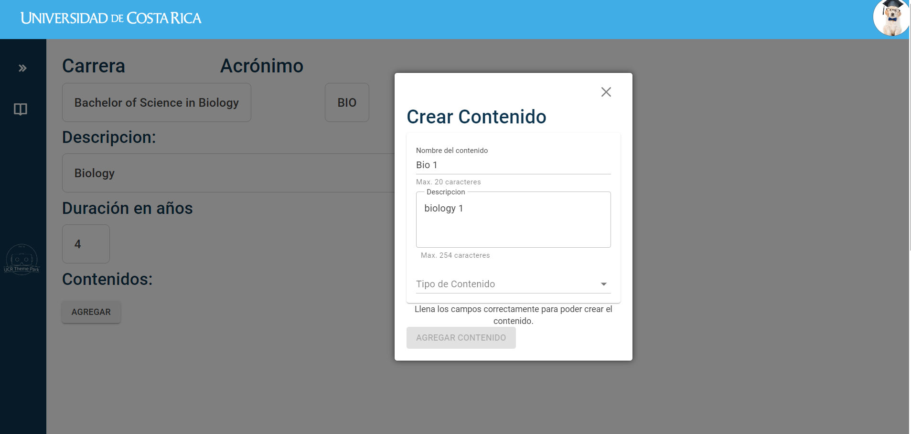

[x] Buscar una carrera por nombre (5%), tarea realizada en frontend, al estar en la pagina de listar carreras se puede buscar una carrera por su nombre en la barra de busqueda que se encuentra en la parte superior de la pagina.

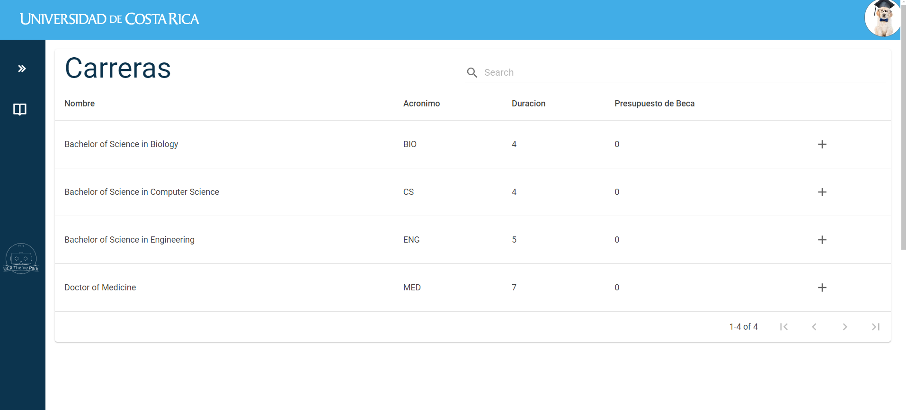

[x] CRUDL de contenidos de una carrera (5%), al encontrarse en la pagina de mostrar carrera se pueden agregar, editar y eliminar contenidos de la carrera, ademas del listado visual de los contenidos.

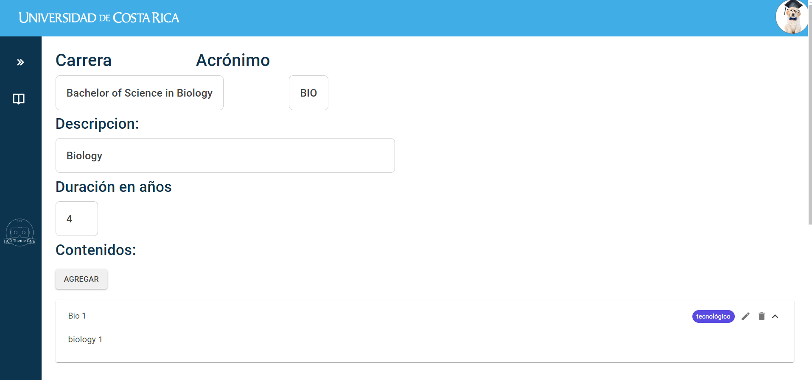
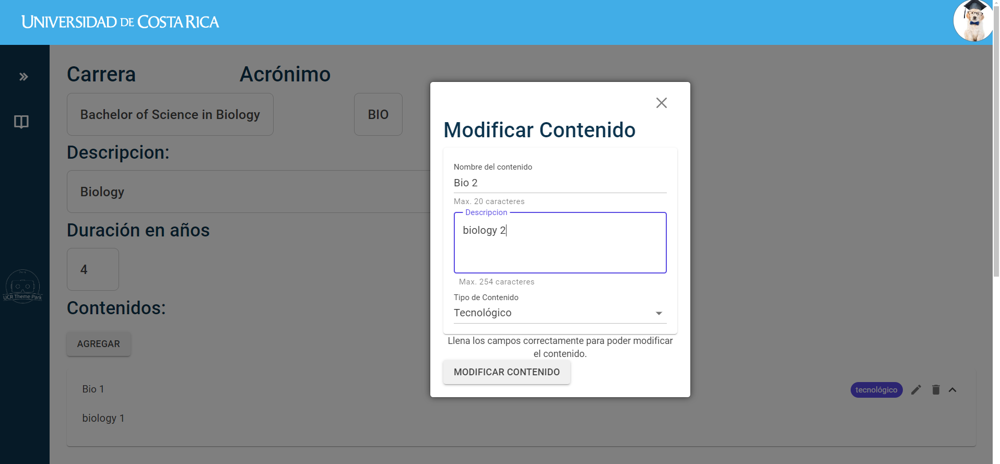
Como se puede apreciar, al crear un contenido se puede seleccionar el tipo de contenido que se esta creando, y al editar un contenido se puede modificar el tipo de contenido que se esta editando, de misma manera, si se modifica se ira actualizando el budget de la careera en tiempo real.
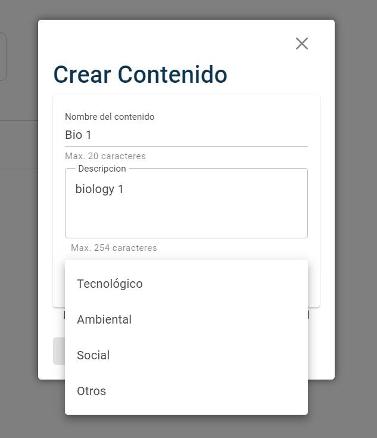

[x] Mostrar información de una carrera con su presupuesto de becas (30%), gracias a un nuevo servicio implementado en backend, y en frontend, se puede apreciar el budget de cada carrera al listarlas. Ese budget es dinamico, es decir que si agrego o quito nuevo contenido a una carrera, el budget se actualiza automaticamente.

Por ejemplo, si se le agrega un contenido de tipo tecnico a la carrera de Ingenieria en Computacion, el budget de becas de esa carrera se actualizara automaticamente.
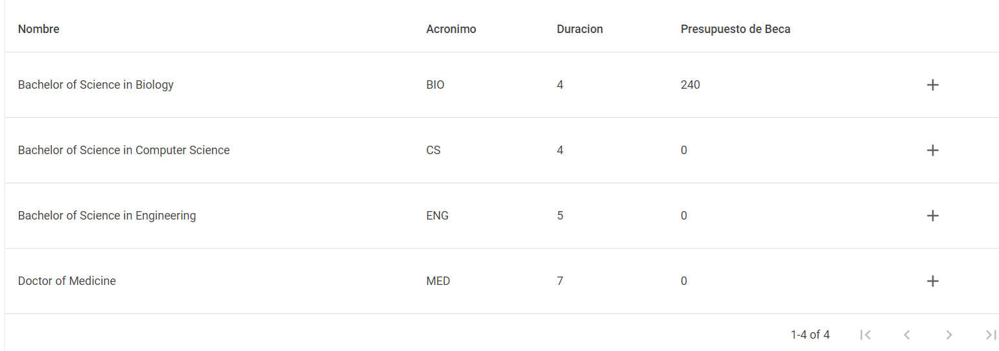

[x] Mostrar información de una carrera con sus contenidos (5%), al estar en la pagina de mostrar carrera se puede ver la descripcion de la carrera y los contenidos asociados a esta, ademas de eso se agregaron en esa misma pagina las opciones para modificar y eliminar los contenidos de la carrera. Al introducir el concepto de tipo de contentido, se puede ver el tipo de contenido que se esta mostrando en la pagina de mostrar carrera.

Tras agregar un contenido de tipo tecnico a la carrera de Ingenieria en Computacion, se puede ver que el contenido de tipo tecnico se muestra en la pagina de mostrar carrera.
Una posible mejora seria agregar un campo para ver los nuevos datos que se agregaron a la carrera, como el budget de becas, el porcentaje de mujeres en la carrera, si es steam o no, y si es computación o no.

### 2. Crear los proyectos de pruebas en la solución. Programar pruebas unitarias y de integración para las principales clases de las capas de dominio, aplicación e infraestructura. Recuerde programar pruebas de integración entre la capa de infraestructura y la base de datos, así como entre la capa de aplicación y la capa de infraestructura. Debe aplicar una estrategia de pruebas automatizadas de acuerdo a lo estudiado en el curso, para esto, debe ir  desarrollando las pruebas conforme desarrolla la aplicación y debe aplicar las distintas técnicas que le aseguren los distintos tipos de cobertura. Debe dejar evidencia documentada del proceso de diseño de pruebas, principalmente para las clases de cálculos (flujos y caminos), y estrategias utilizadas (statement, branch y path coverage | Clases de equivalencia y valores límite). Recomiende y alcance el porcentaje de cobertura (40%).

Se realizaron pruebas unitarias y de integración en gran parte del proyecto, mas que todo en las capas de backend, ya que por cuestiones de tiempo no se pudo realizar pruebas en frontend.
Para grafucar el code coverage realizado por las pruebas unitarias, se utilizo la extension de VS studio "fine code coverage", la cual nos permite ver el porcentaje de cobertura de las pruebas realizadas.

Nota: es importante notar que no tengo certeza que esa herramienta funciona de manera optima, ya que por muchas clases sale que tengo una cobertura del 100%, lo cual deberia ser complicado de lograr.

Se realizaron pruebas unitarias para las siguientes capas:
[x] Domain
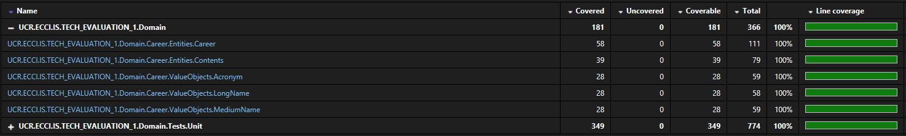
[x] Infrastructure
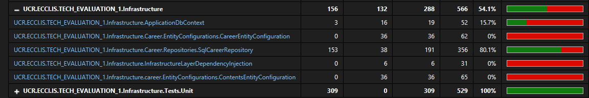
[x] Application
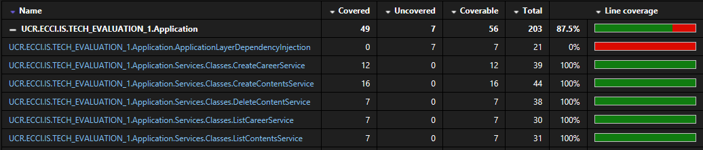

Por cuestiones de tiempo solo se pudieron realizar pruebas de integracion de la capa de infraestructura con la base de datos, pero visto de un punto de vista de ingenieria de software, es posiblemente la capa mas importante para realizar pruebas de integracion, ya que es la capa que se encarga de la comunicacion entre la base de datos y el resto del sistema, y por lo tanto es la capa que mas errores puede tener.
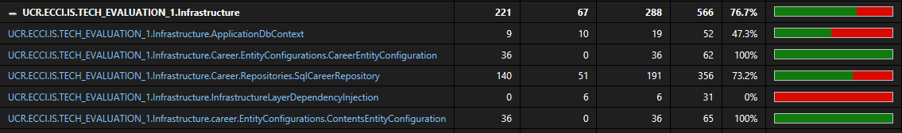

En general se logro una cobertura de pruebas muy alta, pero en algunos casos no se logro una cobertura del 100%. Pero se pudieron probar muchos de los casos de uso del sistema.

### 3. Aseguramiento de la Calidad. Investigue e instale una extensión|paquete en VS que le permita analizar el código (están en el video de laboratorio: Sonarlint, SonarAnalyzer.CSharp, SonarAnalyzer.CSharp.Styling). Analice los resultados del análisis y realice y justifique, al menos, tres mejoras significativas en el código (10%).

Para realizar lo anterior se instalaron las herramientas propuestas en el video y se usaron a lo largo del desarrollo para mejorar la calidad del codigo.
Las principales mejoras que se realizaron fueron:
- Se disminuyo la cantidad de nuevos warnings, como el problema mencionado en el PI, donde muchos warnings "antiguos" se solucionaron, de igual manera se mantuvo una cantidad baja de warnings de 18.
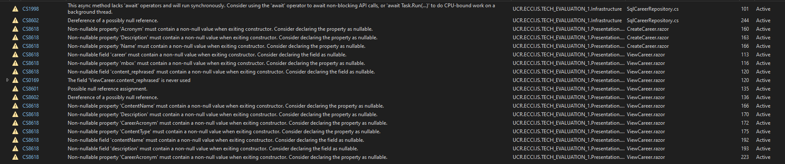
- Se mantuvo una cantidad baja de codigo commentado, ya que es considerado como un code smell. Antes de esa evaluacion se tendia a comentar mucho el codigo, para "tenerlo a mano", pero se aprendio que es mejor tener un codigo limpio y facil de leer, que tener un codigo con muchos comentarios que no aportan mucho al proceso de desarrollo.
- Se mejoro la cobertura de pruebas, ya que al inicio teniamos una cobertura de pruebas de 0%, y al final se logro una cobertura de pruebas de 70-100% en las distintas capas del sistema. Aunque siento que existe bastante margen de mejora en este aspecto para proteger al sistema de posibles errores en el futuro. Como por ejemplo pruebas de posible "nullable" en algunas clases, pero en general siento que se logro un buen trabajo en este aspecto.

### 4. Extra. Investigue e instale una extensión|paquete|herramienta en VS que le permita calcular la cobertura de pruebas detalladas por capa y clases. Detalle el reporte de cobertura y analice los resultados y siguientes pasos (10%).
Como se menciono anteriormente, se utilizo la extension de VS studio "fine code coverage", la cual nos permite ver el porcentaje de cobertura de las pruebas realizadas.
Muchas de las pruebas realizadas pudieron alcanzar una cobertura "acceptable" por la industria, es decir entre 70% y 100%, pero como ya mencionado, dudo de la veracidad de la herramienta, ya que en muchas clases se alcanzo una cobertura del 100%, lo cual deberia ser complicado de lograr.

Una de las pruebas mas interesantes y que mostro el mayor challenge fueron las pruebas de unidad en la capa de infrastructure, ya que algunas de las funciones tenian muchos condicionales y era dificil de probar todos los casos posibles. Pero en general se alcanzo un cobertura alta de las funciones, con principal "debilidad" las funciones con muchos condicionales y con throw exceptions que encontre complicado de provocar.

# Evaluación técnica 1.

## Enunciado & rubros de puntaje

### Parte 1. Fundamentos de la ingeniería de software, análisis y discusión (9%). Una página para la respuesta de cada pregunta.

1. Como ingeniero/ingeniera de software. El equipo de desarrollo al que usted pertenece en su organización utiliza la metodología Scrum como la metodología para el desarrollo de software. Actualmente la gerencia técnica está planeando cambiar la metodología a XP. Describa en detalle un caso a favor de continuar con la metodología Scrum, y un caso a favor de cambiar a la metodología XP. Para su respuesta considere los fundamentos de cada metodología, las similitudes y las diferencias, los roles, sesiones y artefactos, y las reglas del proceso de cada uno de ellos. Finalmente, de una recomendación justificada técnicamente sobre la selección de la metodología a la gerencia técnica de su organización (4.5%).

2. Como ingeniero/ingeniera de software. El equipo de desarrollo al que usted pertenece en su organización no ha utilizado hasta el momento arquitecturas limpias, código limpio y principios SOLID en el desarrollo de las aplicaciones. Explique los principales beneficios (con ejemplos) de cada una de estas prácticas e indique cuál es su recomendación para implementar la utilización de estas como parte de su proceso de desarrollo. Sea puntual mencionando cada concepto, las ventajas que ofrece y porqué (con ejemplos) (4.5%).

En mediación: adjunte los artefactos/documentos desarrollados en formato editable y PDF. **No subir archivos comprimidos**. El subir un archivo comprimido representa un cero en la nota respectiva.

### Parte 2. Requerimientos (15%).

Importante: La parte 2 y 3 se desarrolla a partir del siguiente caso de estudio.

**Caso de estudio.**

La Universidad ha empezado a implementar un Campus de Realidad Virtual (VR), recientemente cuatro equipos de desarrollo han trabajado en funcionalidades para ofrecer interacción a través de edificios y aulas/laboratorios virtuales. La universidad ha determinado que para atraer personas jóvenes que buscan seleccionar una carrera profesional, debe apoyar las ferias vocacionales que se realizan regularmente con tecnologías de VR. Por tanto, se requiere que se trabaje en funcionalidades que permitan ofrecer funcionaliades para las distintas carreras universitarias, y que sean utilizadas en las ferias vocacionales. En primera instancia se requiere que las personas puedan ingresar a una carrera para obtener información novedosa de la misma. El sistema debe permitir buscar y seleccionar una carrera, y ofrecer información básica de la misma, empezando por la aplicación web para las personas administradoras de las ferias.  

De acuerdo con lo descrito en el caso de estudio realice los siguientes ejercicios. Para cada uno de ellos usted como ingeniero/ingeniera de software debe tomar decisiones sobre los flujos recomendados para cada funcionalidad:

1. Especifique al menos un tema, un epic y tres historias de usuario debidamente documentadas sobre cualquiera de las funcionalidades del sistema (seleccionadas por prioridad según su criterio profesional). Describa al menos dos criterios de aceptación por historia de usuario (uno funcional y uno no funcional). Justifique el cumplimiento de los criterios INVEST para cada una de las historias (8%).

2. Especifique tres requerimientos no funcionales prioritarios para el sistema, clasifíquelos y cuantifíquelos. Justifique la selección (7%).

En mediación: adjunte los artefactos/documentos desarrollados en PDF. No subir archivos comprimidos. El subir un archivo comprimido representa un cero en la nota respectiva.

### Parte 3. Repositorios y herramientas de desarrollo (70%).

La parte 3 se desarrolla a partir del caso de estudio anterior y la especificación adicional del sistema que se provee a continuación.

Utilice el siguiente link de GitHub Classroom para crear su repositorio de trabajo: https://classroom.github.com/a/PFe5gw02

Continuación del caso de estudio.

La universidad requiere que la aplicación tenga la información de las carreras en una base de datos relacional:

- Carreras que se ofrecen.

- Contenidos que se muestran por cada carrera. Cada carrera puede tener uno más contenidos.

Requerimientos prioritarios para la aplicación:

Desarrolle una aplicación que permita realizar las operaciones básicas prioritarias (mínimo producto viable) para:

- Agregar contenidos a una carrera.

- Agregar una carrera.

- Buscar una carrera por nombre.

- Mostrar información de una carrera.

Debe ofrecer la funcionalidad como servicios web / backend y página web, que en un futuro puedan ser utilizados por un ambiente de realidad virtual.

Para desarrollar la aplicación utilice las tecnologías utilizadas en el curso hasta el momento (C#, SQL Server, EF Core, Web API, Blazor y otros). Es obligatorio el uso de repositorios de código y las buenas prácticas de la ingeniería del software aprendidas en el curso, por ejemplo: principios de la metodología XP y Scrum [incluyendo la programación en parejas], principios de arquitecturas limpias y sus reglas de dependencia, cada uno de los principios SOLID y principios de código limpio, sin limitarse a estos. Todo lo anterior debe ser considerado cuando diseñe e implemente la solución. La evaluación se realiza utilizando la técnica de programación en parejas.

Debe definir los requisitos mínimos que debe cumplir para decidir si el producto está listo (DoD, por ejemplo, los del proyecto del Sprint en ejecución). Desarrolle solo el mínimo producto viable de la funcionalidad prioritaria indicada. Se espera una solución limpia, respecto al código y la arquitectura, que considere el cumplimiento de los principios SOLID.

El producto y proceso se evalúa de acuerdo con: la completitud del desarrollo del proyecto de datos, la completitud del desarrollo del proyecto y su solución limpia, las buenas prácticas de ingeniera de software que incluyen la calidad del proceso y del producto, el valor de negocio que provee y si es un producto es potencialmente entregable. Los docentes consideran cada uno de estos aspectos para la asignación de la nota de cada parte que se detalla a continuación.

Se espera que realice las siguientes actividades en orden:

1. Utilizar un repositorio para la administración del código del proyecto de datos y del código de la aplicación (solución y sus proyectos). Configurar el archivo gitignore. (4%).

2. Crear la solución y el proyecto de datos en el main del repositorio y clonar en un branch con el nombre devCARNET. Programar lo necesario para administrar los datos de su aplicación en una base de datos SQL Server en el branch devCARNET. Realizar commits al branch devCARNET e integre cada vez que tenga parte de la funcionalidad finalizada y funcionando al branch main, lo que implica realizar los procesos de integración (10%).

3. Crear los proyectos para la aplicación en la solución (frontend y backend). Programar la funcionalidad necesaria de la aplicación en el branch devCARNET. Realice commits al branch devCARNET e integre cada vez que tenga parte de la funcionalidad finalizada y funcionando al branch main, lo que implica realizar los procesos de integración. Aplique todas las buenas prácticas de la ingeniería de software (30%).

4. Análisis y discusión. Basado en los principios de arquitecturas limpias y SOLID, y la funcionalidad de la aplicación web desarrollada, realice un análisis donde indique que decisiones de diseño recomienda para cumplir cada uno de los principios y la arquitectura limpia. Para esto justifique como cumplir las reglas de dependencia y cada uno de los principios SOLID según la implementación de la solución y ejemplificando sus argumentos. El análisis debe agregarlo a un archivo readme en el directorio raíz del repositorio (.md) (12%).

Indique en el archivo readme qué partes logró entregar y cuáles no. Indique si está entregando versiones funcionales. Si no cumplió con lo requerido, describa los principales problemas que se le presentaron y cómo los resolvería en una siguiente iteración. Antes de finalizar la evaluación debe hacer los commits and push de lo realizado, para asegurar que la solución está en el repositorio remoto.

En mediación: adjunte el link al repositorio.

Coevaluación: realice la distribución del 100% de la nota entre las personas participantes de acuerdo con su contribución en la evaluación.

## Guía de uso de la aplicación
Nuestra aplicación propone cuatro servicios web que permiten realizar las operaciones básicas prioritarias para la gestión de carreras y contenidos. Estos servicios son:
- Agregar contenidos a una carrera.
- Agregar una carrera.
- Listar carreras.
- Mostrar información de una carrera.

La aplicación para proponer estos servicios usa una multitud de paginas tales como:
- la pagina principal, propone un acceso rapido a listar y crear carreras:
[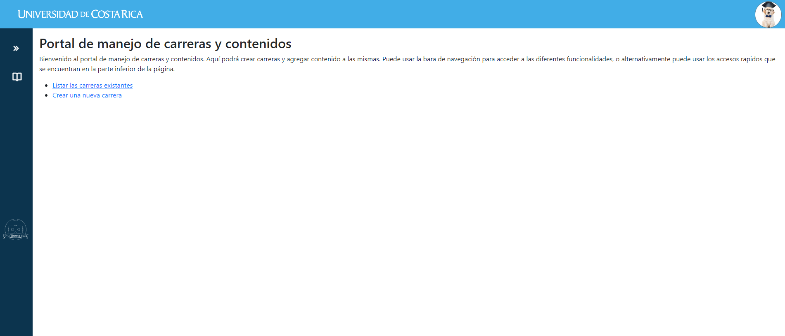](documentation/main_page.png)

- la pagina de crear carrera, permite agregar una nueva carrera a la base de datos:
 

- la pagina de listar carreras, permite ver todas las carreras en la base de datos:

- la pagina de mostrar carrera, permite ver los detalles de una carrera en particular, siendo la descripcion y los contenidos asociados a esta:

- dentro de la pagina anteriormente mencionada se puede crear un nuevo componente a la dada carrera:

## Diseño de la base de datos
La base de datos esta compuesta de una total de 2 tablas, las cuales son:
- Carreras
- Contenidos
Y siguen la siguiente estructura de entidades y relaciones:

[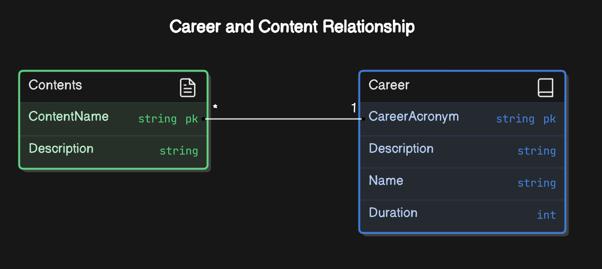](documentation/ERD_database_diagram.png)

Los requerimientos de la base de datos son los siguientes:
La universidad requiere que la aplicación tenga la información de las carreras.
Puede haber tantas carreras como se desee.
Cada carrera puede tener cero contenidos o tantas como se desee.
Cada contenido pertenece a una sola carrera.
Una carrera tiene un nombre, una descripción, una acronimo, una duration en años y una lista de contenidos.
Un contenido tiene un nombre y una descripcion.
Una carrera puede tener varios contenidos con el mismo nombre y descripcion.

## Analisis y discusión
Nuestra architectura cumple con los principios de SOLID y arquitecturas limpias. Nuestro programa sigue la misma formación de capas que usamos en el ejemplo presentado en clase, tal que tenemos una capa de presentación, una capa de dominio, una capa de aplicación y una capa de infraestructura. La cuales estan repartidas en carpetas llamadas frontend, backend, database y shared.
Cada uno de los principios SOLID se cumple de la siguiente manera:
- **Single Responsibility Principle**: Cada clase tiene una unica responsabilidad y resuelve un problema bien definido. De esa manera si una clase ya esta funcional solo occupamos agregar nuevas clases para implementar nuevas tareas en vez de cambiar la clase ya existente.
- **Open/Closed Principle**: Nuestro programa esta abierto a la extension y cerrado a la modificacion. Como lo ya mencionado al tener cada clase una unica responsabilidad, cuando queremos agregar una nueva funcionalidad solo necesitamos agregar una nueva clase y no modificar las ya existentes.
- **Liskov Substitution Principle**: Nuestro programa permite que una clase hija pueda ser usada en lugar de una clase padre. Muchas de nuestras clases usan herecia para implementar funcionalidades comunes.
- **Interface Segregation Principle**: Nuestro programa tiene muchas interfaces para cada feature que implementamos.
- **Dependency Inversion Principle**: Nuestro programa al usar una estrucutra de capa bien definida permite hacer que las capas de arribe no dependan de las capas de abajo. De esa manera podemos cambiar la implementacion de una capa sin afectar las demas.

Nuestro codigo fuente sigue las convenciones de clead code y es facil de leer y entender. Cada clase tiene un nombre que refleja su funcionalidad y cada metodo tiene un nombre que refleja su funcionalidad. Ademas hicimos un gran esfuerzo para documentar el codigo fuente y explicar cada parte de nuestro programa.
El flujo de trabajo en Github fue el siguiente:
- Creamos un branch devCARNET para trabajar en la funcionalidad de la aplicacion, fue una branch en commun donde ibamos mandando codigo fuente funcional.
- Creamos para cada funcionalidad una branch separada para trabajar en ella, como por ejemplo feature/add_career 
- Al finalizar el trabajo se realizo un merge a main del contenido de devCARNET

## Coevaluación
La coevaluación se realizo de la siguiente manera:
- **Fernando Arce Castillo**: 50%
- **Archibald Emmanuel Carrion Claeys**: 50%

## Link al repositorio
El link al repositorio es el siguiente: [Repositorio](https://github.com/UCR-PI-IS/evaluacion-tecnica-1-FerAC)

## Usos del codigo
El codigo fue escrito por Fernando Arce Castillo y Archibald Emmanuel Carrion Claeys.
Algunas funcionanilidades se basan en codigo presentados en clase y codigo realizado por nosotros en el proyecto de PI.
Por ejemplo, algunos elementos del frontend tales como el sidebar a la izquierda de la pagina, y los headers y footers de las paginas.